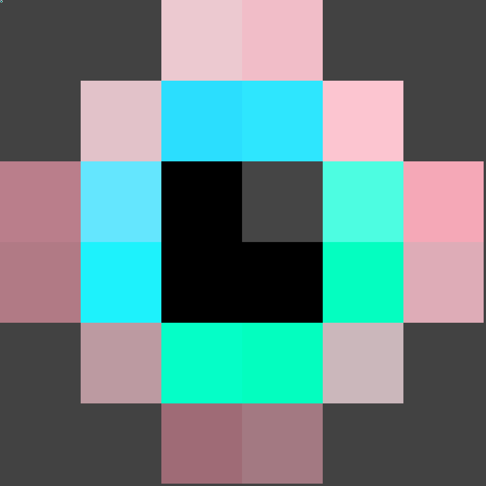
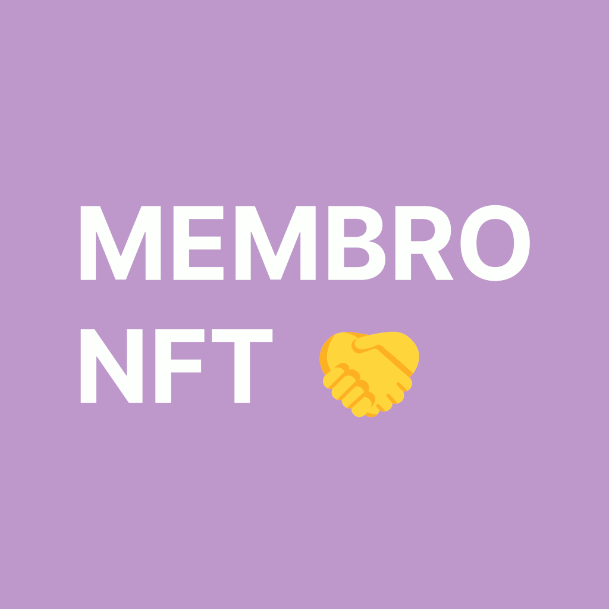

# NFT Dummy Assets 

   

Making test NFT deploment easier by providing dummy NFT arts with metadata. 100% compatible with thirdweb platform. These are the NFT dummy arts I use for test and educational purposes.

## ⏬ Dummy Collections

| Preview                                                       | Name                                              | Description                                                                                                                                                   |
| ------------------------------------------------------------- | ------------------------------------------------- | ------------------------------------------------------------------------------------------------------------------------------------------------------------- |
|  | [Mata NFT](src/collections/mata-nft/readme.md) | A dummy NFT collection of 30 unique pixelated arts based on HashLips Art Engine sample assets. This is for testing purposes only and not real NFT collection. |
|  | [Emoji NFT](src/collections/emoji-nft/readme.md)  | A dummy NFT collection of 1000 unique emoji with custom background and patterns. This is for testing purposes only and not real NFT collection.               |
|  | [Membro NFT](src/collections/membro-nft/readme.md)  | A dummy NFT membership collection of 500 unique metadata with one image only as a representation. This is for testing purposes only and not real NFT membership collection.               |

## 🎯 Contributing

Contributions are welcome, create a pull request to this repo and I will review your code. Please consider to submit your pull request to the `dev` branch. Thank you!

Read the project's [contributing guide](./contributing.md) for more info.

## 🐛 Issues

If you're facing a problem in using GatherTownJS please let me know by [creating an issue here](https://github.com/warengonzaga/nft-dummy-assets/issues/new). I'm here to help you!

## 📋 Code of Conduct

Read the project's [code of conduct](./code_of_conduct.md).

## 📃 License

NFT Dummy Assets is licensed under [The MIT License](https://opensource.org/licenses/MIT).

## 🍀 Sponsor

> Love what I do? Send me some [love](https://github.com/sponsors/warengonzaga) or [coffee](https://buymeacoff.ee/warengonzaga)!? 💖☕
>
> Can't send love or coffees? 😥 Nominate me for a **[GitHub Star](https://stars.github.com/nominate)** instead!
> Your support will help me to continue working on open-source projects like this. 🙏😇

## 📝 Author

NFT Dummy Assets is created by **[Waren Gonzaga](https://github.com/warengonzaga)**, with the help of awesome [contributors](https://github.com/warengonzaga/nft-dummy-assets/graphs/contributors).

---

💻💖☕ by [Waren Gonzaga](https://warengonzaga.com) | [He is Awesome](https://www.youtube.com/watch?v=HHrxS4diLew&t=44s) 🙏
