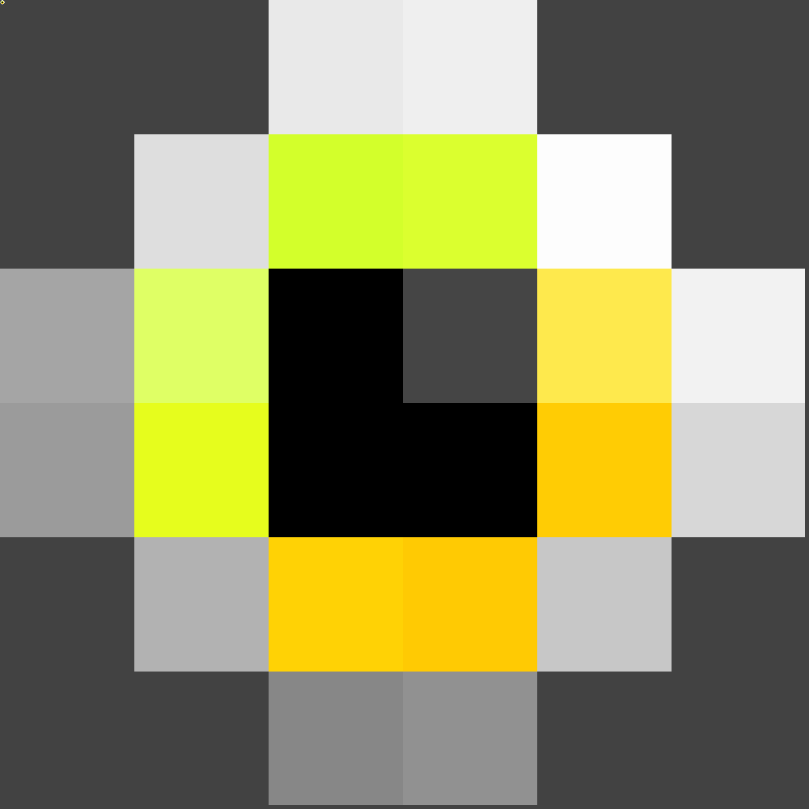

# Mata NFT

| | | | | |
| --- | --- | --- | --- | --- |
|  |  |  |  |  |

Mata NFT is a dummy NFT asset composed of 25 pieces unique pixelated eyes generated by [Waren Gonzaga](https://warengonzaga.com) using the [thirdweb art engine](https://github.com/warengonzaga/thirdweb-art-engine). Recommended for testing unique NFT deployment that usess **ERC-721** standard.

[ [Download Mata NFT Assets](../../../builds/mata-nft.zip) ]

---

💻💖☕ by [Waren Gonzaga](https://warengonzaga.com) | [YHWH](https://youtu.be/HHrxS4diLew?t=44) 🙏
