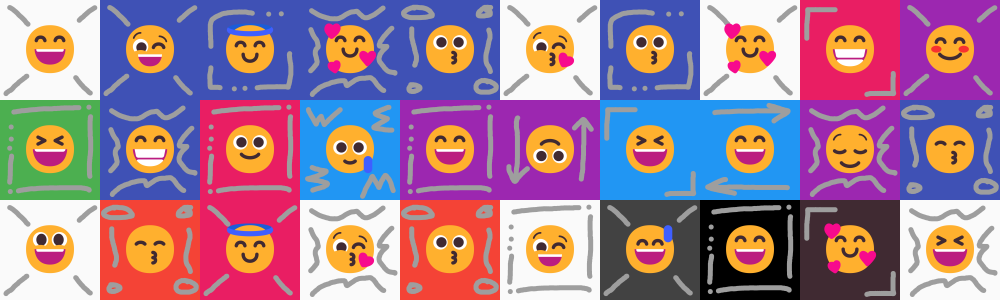

# Emoji NFT [](https://github.com/warengonzaga)

Emoji NFT is a dummy NFT asset composed of 1,000 pieces unique emoji with custom background and patterns generated by [Waren Gonzaga](https://warengonzaga.com) using the [thirdweb art engine](https://github.com/warengonzaga/thirdweb-art-engine). Recommended for testing unique NFT deployment that uses **ERC-721** standard.

[](../../../builds/emoji-nft.zip) [](https://thirdweb.com/deployer.thirdweb.eth/SignatureDrop)

## 👀 Preview



## 🧩 Metadata

Here's the suggested information you can use for test deployments.

| Image | Name | Description | Symbol |
| --- | --- | --- | --- |
|  | Emoji NFT | A dummy NFT collection of 1000 unique emoji with custom background and patterns. This is for testing purposes only and not real NFT collection. | $EMOJI |

## 🗃️ File Structure

These are the contents of the compressed `emoji-nft.zip` file.

```text
📂metadata
    └─📃_metadata.json
    └─📃0.json
    └─📃1.json
    └─📃...
📂images
    └─🖼️0.png
    └─🖼️1.png
    └─🖼️...
📂thirdweb
    └─📃_metadata.json
    └─🖼️0.png
    └─🖼️1.png
    └─🖼️...
🖼️preview.gif
🖼️preview.png
📃readme.md
```

> **Note**: If you are using [_thirdweb_](https://thirdweb.com?utm_source=waren), use the **📁 thirdweb** folder to drag and drop to the dashboard upon batch upload. It's 100% compatible! 👀

## 🎨 Art Layers

Layers used to generate the Emoji NFT collection using [thirdweb art engine](https://github.com/warengonzaga/thirdweb-art-engine).

```
📁 background
📁 pattern
📁 emoji
```

## 🍀 Sponsor

Love this dummy NFT collection? Support the creator and show some love! 💖
<https://github.com/sponsors/warengonzaga>

## 📃 License

Emoji NFT Dummy Assets is licensed under [The MIT License](https://opensource.org/licenses/MIT).

---

💻💖☕ by [Waren Gonzaga](https://warengonzaga.com) | [He is Awesome](https://www.youtube.com/watch?v=HHrxS4diLew&t=44s) 🙏
